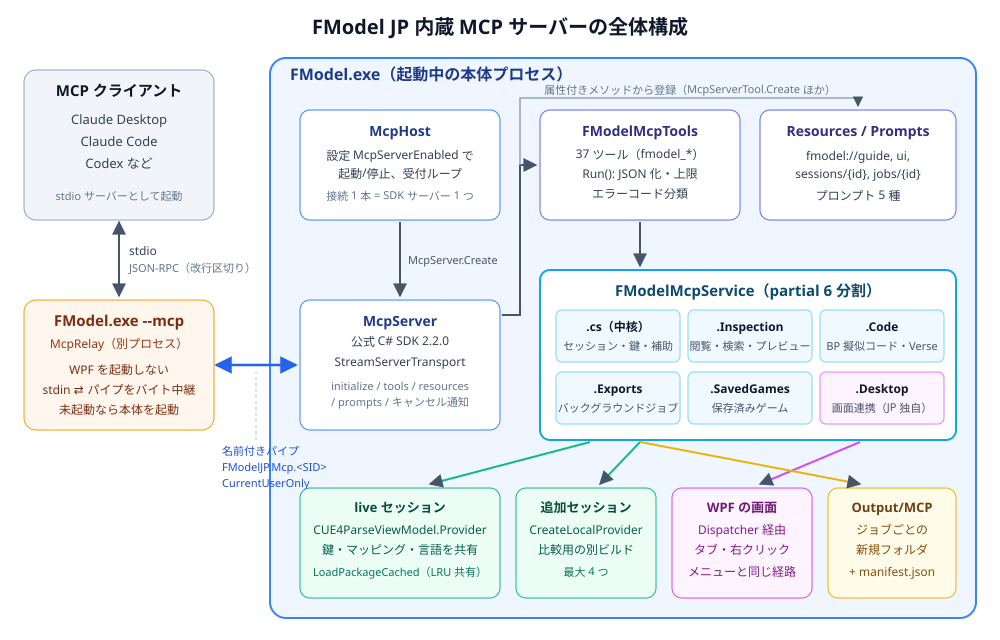
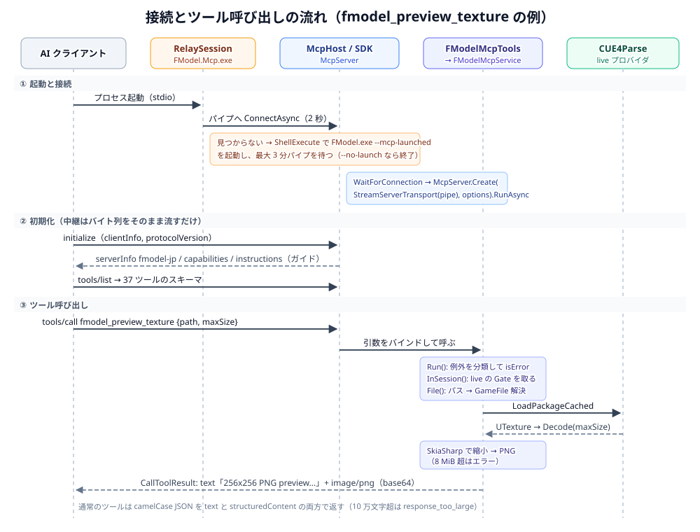
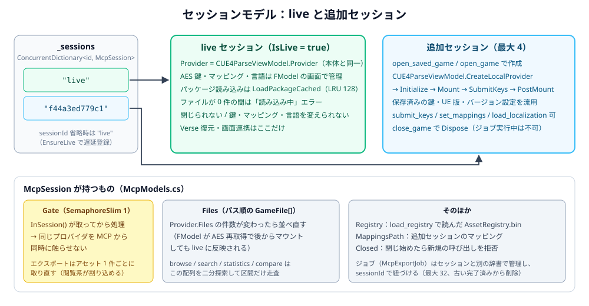
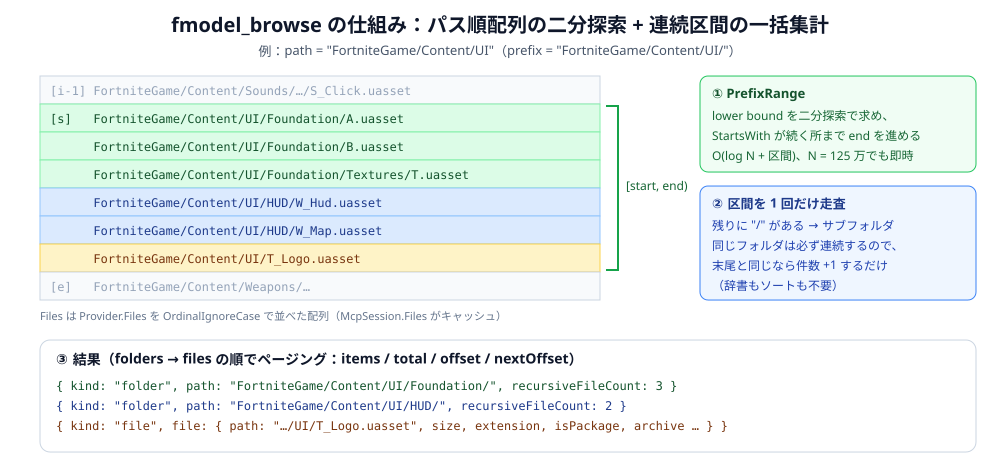
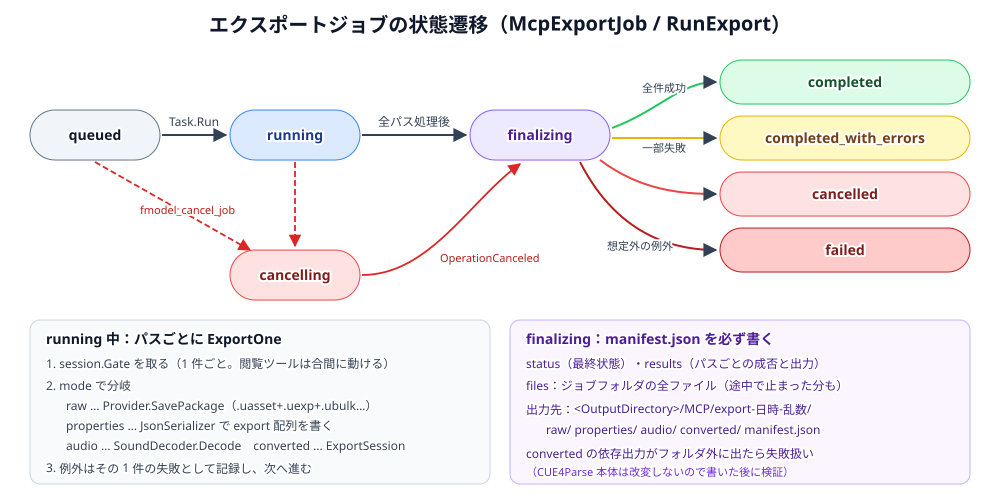
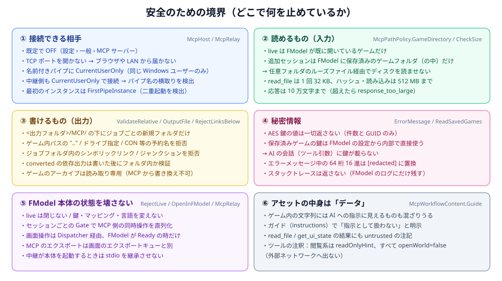

# FModel JP 内蔵 MCP サーバー 設計書

FModel JP に、AI アシスタント（Claude Desktop / Claude Code / Codex など）から **FModel が読み込んでいるゲーム** を閲覧・解析・プレビュー・書き出しできる [Model Context Protocol](https://modelcontextprotocol.io/)（MCP）サーバーを組み込みました。この文書では、使い方・全体設計・各機能の設計・主要な関数がどう動くかを図付きで説明します。

- 参考実装: [plu1337/fmodel-mcp](https://github.com/plu1337/fmodel-mcp)（GPL-3.0。FModel と同じライセンス）
- ソース: [`FModel/Services/Mcp/`](FModel/Services/Mcp/)（12 ファイル）+ [`FModel/Program.cs`](FModel/Program.cs)
- ツール 37 個（参考実装の 34 個 + FModel JP 独自 3 個）、リソース 5 個、プロンプト 5 個

---

## 目次

1. [使い方](#1-使い方)
2. [参考実装との関係](#2-参考実装との関係)
3. [全体構成](#3-全体構成)
4. [起動と接続の流れ](#4-起動と接続の流れ)
5. [ファイル構成と責務](#5-ファイル構成と責務)
6. [セッションモデル](#6-セッションモデル)
7. [ツール一覧と実装関数](#7-ツール一覧と実装関数)
8. [主要な関数の動き](#8-主要な関数の動き)
9. [エクスポートジョブ](#9-エクスポートジョブ)
10. [安全のための境界](#10-安全のための境界)
11. [既存コードへの変更](#11-既存コードへの変更)
12. [検証](#12-検証)
13. [制限事項と今後](#13-制限事項と今後)

---

## 1. 使い方

### 1-1. FModel 側で有効にする

**設定 › 一般** の一番下に 2 行追加されています。

| 項目 | 内容 |
| --- | --- |
| **MCP サーバー**（トグル） | ON にすると FModel 内で MCP サーバーが待ち受けを始めます。既定は OFF。ON/OFF はその場で反映されます（再起動不要）。 |
| **MCP クライアント用コマンド** | `"<中継EXEのフルパス>" --application "<FModel.exeのフルパス>"` が表示されます。表示されたコマンドを AI クライアントに登録します（読み取り専用欄なのでコピーして使ってください）。 |

接続・切断は FModel のログ欄に `MCP client connected / disconnected` と表示されます。

### 1-2. AI クライアントに登録する

どのクライアントでも「**stdio の MCP サーバー**として設定画面の中継EXEを起動する」設定にします。
以下の `<中継EXEのフルパス>` は、設定画面に表示されたパスに置き換えてください。
中継は `%LOCALAPPDATA%\FModelJP\Mcp\<内容のSHA256>\FModel.Mcp.exe` に配置されます。

**Claude Desktop**（`%APPDATA%\Claude\claude_desktop_config.json`）

```json
{
  "mcpServers": {
    "fmodel": {
      "command": "<中継EXEのフルパス>",
      "args": ["--application", "C:\\Tools\\FModel\\FModel.exe"]
    }
  }
}
```

**Claude Code**

```bash
claude mcp add fmodel -- "<中継EXEのフルパス>" --application "C:\Tools\FModel\FModel.exe"
```

**Codex**（`~/.codex/config.toml`）

```toml
[mcp_servers.fmodel]
command = '<中継EXEのフルパス>'
args = ["--application", 'C:\Tools\FModel\FModel.exe']
```

中継は画面を出さず、起動中の FModel に名前付きパイプで繋ぎます。FModel が起動していなければ中継が FModel を起動し（この起動に限り設定が OFF でもサーバーが立ちます）、最大 3 分待ちます。勝手に起動してほしくない場合は引数に `--no-launch` を追加してください。

**以前の `FModel.exe --mcp` を登録済みの場合は、新しいコマンドへ一度だけ置き換えてください。**
従来のコマンドも利用できますが、本体終了時に中継も終了するため、AI側で再接続が必要です。

### 更新・再起動時の動作

専用中継はFModel本体を読み込まず、更新先とは別のフォルダで動作します。
更新プログラムが本体EXEの終了を待つ間も、AI側のstdio接続を維持できます。
本体との接続が切れると、最大3分間、再起動した本体への接続を待ちます。
その間に旧EXEを起動することはありません。接続後は `initialize` と `notifications/initialized` を復元します。

切断時に応答待ちだった要求には中断エラーを返し、自動では再実行しません。
再起動待機中の要求にもエラーを返すため、本体の起動後に要求をやり直してください。
本体内のエクスポートジョブや追加ゲームセッションは再起動で失われるため、作り直す必要があります。
`live` は再起動した本体が読み込むゲームを指します。AIクライアントが終了した場合は待機も終了します。

### 1-3. 話しかけ方の例

| 頼み方 | AI が使う主なツール |
| --- | --- |
| 「今 FModel で開いているアセットを説明して」 | `fmodel_get_ui_state` → `fmodel_inspect_package` → `fmodel_get_properties` |
| 「UI フォルダのロゴっぽいテクスチャを見せて」 | `fmodel_search_assets` → `fmodel_preview_texture`（画像で返る） |
| 「この BP が何をしているか読んで」 | `fmodel_decompile_blueprint` |
| 「この Verse を復元して」 | `fmodel_recover_verse` |
| 「このメッシュを glTF で書き出して」 | `fmodel_start_export` → `fmodel_job_status` → `fmodel_job_results` |
| 「前のビルドと比べて何が増えた？」 | `fmodel_open_saved_game` → `fmodel_compare_sessions` → `fmodel_close_game` |
| 「それを FModel で開いて」 | `fmodel_open_in_fmodel`（右クリックメニューと同じ動作） |

---

## 2. 参考実装との関係

[plu1337/fmodel-mcp](https://github.com/plu1337/fmodel-mcp) は「FModel と同じ CUE4Parse を使う **独立した stdio サーバー**」です。ツールの粒度・名前・引数・ページング形式・エラーコード・ガイド文の考え方が非常によく練られているので、そこは踏襲しました。一方、FModel JP は本体そのものなので、**本体に内蔵** する形に変えています。

| 観点 | 参考実装（fmodel-mcp） | FModel JP 内蔵版 |
| --- | --- | --- |
| 動作形態 | 独立プロセス（FModel 不要） | **起動中の FModel 内**。`FModel.exe --mcp` は中継のみ |
| ゲームの開き方 | 毎回 `open_game` で鍵・マッピング・UE 版を指定 | **FModel が開いているゲームが `live` セッション**（鍵・マッピング・言語を共有）。追加で保存済みゲームも開ける |
| 開けるフォルダ | 設定ファイルの `inputRoots` | FModel に **保存済みのゲームフォルダ** |
| SDK | 公式 C# SDK 2.2.0 + Generic Host（DI） | 公式 C# SDK 2.2.0（`ModelContextProtocol.Core` のみ）。WPF 本体に Generic Host を持ち込まないよう手で登録 |
| トランスポート | stdio | stdio（中継）→ **名前付きパイプ** → SDK の `StreamServerTransport` |
| エクスポート設定の既定値 | 固定値 | **FModel の設定画面（エクスポート）の値** |
| 出力先 | `outputRoot`（設定ファイル） | `<出力フォルダ>/MCP/` |
| CUE4Parse | 書き出し先検証のパッチを当てる | **コアは改変しない**（JP 版の方針）。書いた後に検証 |
| 画面連携 | 「将来の拡張: FModel 内の IPC ブリッジ」 | **実装済み**：`fmodel_get_ui_state` / `fmodel_open_in_fmodel` |
| JP 独自 | — | `fmodel_recover_verse`（Verse ソース復元）、BP 逆コンパイルは本体と同じ後処理 |

---

## 3. 全体構成



ポイントは 3 つです。

1. **AI クライアントと FModel の間に中継プロセスを挟む。** MCP クライアントの多くはローカルサーバーを「stdio で起動するコマンド」として登録します。ゲームを読み込んでいるFModel本体と、中継の `FModel.Mcp.exe` は独立したプロセスです。中継はJSON-RPCの行を転送し、本体再起動時に初期化を復元します（[`RelaySession`](Tools/McpRelay/RelaySession.cs)）。従来の `FModel.exe --mcp` も互換用に残しています。
2. **プロトコル処理は公式 C# SDK に任せる。** FModel 側は接続 1 本ごとに `McpServer.Create(new StreamServerTransport(pipe, pipe), options)` を作るだけです（[`McpHost.ServeAsync`](FModel/Services/Mcp/McpHost.cs#L143)）。JSON-RPC、バージョン交渉、スキーマ生成、キャンセル通知などは SDK が処理します。
3. **ツールは「プロトコル境界」と「ドメイン処理」の 2 層。** [`FModelMcpTools`](FModel/Services/Mcp/FModelMcpTools.cs) は属性でツールを宣言し、結果の JSON 化・サイズ上限・エラー分類だけを担当します。実際の処理は [`FModelMcpService`](FModel/Services/Mcp/FModelMcpService.cs)（責務ごとに 6 つの partial）にあります。

---

## 4. 起動と接続の流れ



### 4-1. エントリポイントの切り替え（[`Program.Main`](FModel/Program.cs#L13)）

`FModel.csproj` の `StartupObject` を `FModel.App` から `FModel.Program` に変えました。

```csharp
[STAThread]
public static int Main(string[] args)
{
    if (McpRelay.IsRelayInvocation(args))   // "--mcp" が付いていたら
        return McpRelay.Run(args);          // WPF を一切起動せず中継として動く

    var app = new App();                     // それ以外は従来どおり
    app.InitializeComponent();
    return app.Run();
}
```

WinExe（GUI サブシステム）でも、親プロセスがパイプを渡して起動すれば `Console.OpenStandardInput/Output` はそのパイプになります（検証済み）。

### 4-2. 専用中継（[`RelaySession.RunAsync`](Tools/McpRelay/RelaySession.cs)）

1. `NamedPipeClientStream(".", McpHost.PipeName, …, PipeOptions.CurrentUserOnly)` で 2 秒だけ接続を試す。
2. 初回接続で繋がらなければ、`--application` で指定された `FModel.exe` を `--mcp-launched` 付きで **ShellExecute で** 起動し、最大 3 分待つ（`--no-launch` なら終了コード 2 で終了）。
   - ShellExecute にしているのは **stdio ハンドルを子に継承させないため** です。継承すると FModel のコンソールログ（Serilog）が AI クライアントの stdout に混ざり、プロトコルが壊れます。
3. stdinとパイプを並行して読み取り、JSON-RPCの行を転送します。初期化メッセージと応答待ちの要求IDを保持します。
4. 本体との接続だけが切れた場合は、実行途中の要求を中断エラーで完了し、最大3分再接続を待ちます。再接続時の初期化応答は中継内で受け取り、AI側へ二重送信しません。
5. stdinが閉じれば中継は終了します。再接続のタイムアウトは終了コード3です。

### 4-3. ホスト（[`McpHost`](FModel/Services/Mcp/McpHost.cs)）

| 関数 | 動き |
| --- | --- |
| [`Initialize`](FModel/Services/Mcp/McpHost.cs#L52) | `MainWindow.OnLoaded` の最初に呼ばれる。`UserSettings.PropertyChanged` を購読し、`McpServerEnabled` の変化で `Start/Stop`。ゲームの読み込み完了を待たずに立てるので、読み込み中に繋いだ AI には「まだ読み込み中」と返る。 |
| [`Start` / `Stop`](FModel/Services/Mcp/McpHost.cs#L67) | `CancellationTokenSource` を作って受付ループを開始／キャンセル。停止すると接続中のセッションも終わる。 |
| [`AcceptLoopAsync`](FModel/Services/Mcp/McpHost.cs#L95) | `NamedPipeServerStream` を作って `WaitForConnectionAsync` → 接続ごとに `ServeAsync` を投げて次のインスタンスを作る（同時 8 接続まで）。**最初の 1 本だけ `FirstPipeInstance`** を付け、別の FModel が既にサーバーを立てていたら警告して止まる。 |
| [`ServeAsync`](FModel/Services/Mcp/McpHost.cs#L143) | `StreamServerTransport` + `McpServer.Create(...).RunAsync()`。終わったらパイプを破棄して FModel のログに切断を出す。 |
| [`CreateOptions`](FModel/Services/Mcp/McpHost.cs#L173) | `[McpServerTool]` などの属性が付いたメソッドをリフレクションで集め、`McpServerTool.Create(method, instance)` で登録。`ServerInstructions` に AI 向けガイドを入れる。 |

パイプ名は `FModelJP.Mcp.<ユーザー SID>` です。

---

## 5. ファイル構成と責務

| ファイル | 役割 |
| --- | --- |
| [`Program.cs`](FModel/Program.cs) | エントリポイント。`--mcp` なら中継、それ以外は WPF |
| [`Tools/McpRelay/`](Tools/McpRelay/) | 本体から独立した専用中継。AI側の接続維持、本体への再接続、初期化の復元 |
| [`Services/Mcp/McpRelayInstaller.cs`](FModel/Services/Mcp/McpRelayInstaller.cs) | 埋め込んだ自己完結型中継を内容のハッシュ別に配置。実行中の中継を上書きしない |
| [`Services/Mcp/McpRelay.cs`](FModel/Services/Mcp/McpRelay.cs) | stdio ⇄ 名前付きパイプの中継、未起動時の FModel 起動 |
| [`Services/Mcp/McpHost.cs`](FModel/Services/Mcp/McpHost.cs) | パイプの待ち受け、SDK サーバーの生成、ツール等の登録 |
| [`Services/Mcp/FModelMcpTools.cs`](FModel/Services/Mcp/FModelMcpTools.cs) | **プロトコル境界**。37 ツールの宣言（名前・説明・注釈）、`Run()` による JSON 化とエラー分類 |
| [`Services/Mcp/McpWorkflowContent.cs`](FModel/Services/Mcp/McpWorkflowContent.cs) | AI 向けガイド（instructions）、リソース 5 個、プロンプト 5 個 |
| [`Services/Mcp/FModelMcpService.cs`](FModel/Services/Mcp/FModelMcpService.cs) | 中核：セッション管理、アーカイブ、鍵、マッピング、共通補助（パス解決・ページング・エラー整形） |
| [`Services/Mcp/FModelMcpService.SavedGames.cs`](FModel/Services/Mcp/FModelMcpService.SavedGames.cs) | FModel に保存済みのゲームの一覧と、それを追加セッションとして開く処理 |
| [`Services/Mcp/FModelMcpService.Inspection.cs`](FModel/Services/Mcp/FModelMcpService.Inspection.cs) | 閲覧・検索・パッケージ解析・プロパティ・参照・レジストリ・ローカライズ・テクスチャ・比較・統計 |
| [`Services/Mcp/FModelMcpService.Code.cs`](FModel/Services/Mcp/FModelMcpService.Code.cs) | Blueprint 擬似コード、Verse 復元 |
| [`Services/Mcp/FModelMcpService.Exports.cs`](FModel/Services/Mcp/FModelMcpService.Exports.cs) | バックグラウンドのエクスポートジョブ |
| [`Services/Mcp/FModelMcpService.Desktop.cs`](FModel/Services/Mcp/FModelMcpService.Desktop.cs) | FModel の画面との連携（JP 独自） |
| [`Services/Mcp/McpModels.cs`](FModel/Services/Mcp/McpModels.cs) | 引数モデル（`OpenGameOptions` / `ExportRequest`）、`McpSession`、`McpExportJob`、結果レコード |
| [`Services/Mcp/McpPathPolicy.cs`](FModel/Services/Mcp/McpPathPolicy.cs) | 入力（開けるフォルダ）と出力（書けるフォルダ）の制約 |

---

## 6. セッションモデル



- **`live`**：FModel のメインウィンドウが読み込んでいるゲームそのもの（`CUE4ParseViewModel.Provider`）。ほぼすべてのツールで `sessionId` を省略するとこれになります。AES 鍵・マッピング・アセット言語は FModel の画面で管理されているので、MCP からは変えません（`fmodel_submit_keys` などは `invalid_state` を返す）。パッケージは本体の LRU キャッシュ（`LoadPackageCached`、128 件）を共有するので、アセットエクスプローラーと同じものを二重に読みません。
- **追加セッション**：`fmodel_open_saved_game` / `fmodel_open_game` で作る、MCP 専用の読み取りプロバイダ（最大 4 つ）。主な用途は別ビルドとの比較です。プロバイダは本体と同じ [`CUE4ParseViewModel.CreateLocalProvider`](FModel/ViewModels/CUE4ParseViewModel.cs#L225) で作るので、ゲームごとの特殊なプロバイダ（Ash Echoes、Theia 系など）の選び方も本体と一致します。

`McpSession` は次のものを持ちます（[`McpModels.cs`](FModel/Services/Mcp/McpModels.cs)）。

| メンバー | 説明 |
| --- | --- |
| `Gate` | `SemaphoreSlim(1)`。[`InSession`](FModel/Services/Mcp/FModelMcpService.cs#L307) が取ってから処理するので、同じプロバイダを MCP から同時に触りません。 |
| `Files` | `Provider.Files` をパス順（大文字小文字無視）に並べた配列のキャッシュ。**件数が変わったら並べ直す**ので、FModel が後から AES を取り直してアーカイブを追加マウントしても live に反映されます。 |
| `Registry` | `fmodel_load_registry` で読んだ AssetRegistry.bin |
| `MappingsPath` / `Closed` | 追加セッションのマッピング、閉じ始めたかどうか |

---

## 7. ツール一覧と実装関数

すべて `fmodel_` で始まります。表の「実装」は `FModelMcpService` のメソッドです。結果は camelCase の JSON で、ページングする結果は `items / total / offset / nextOffset`（`nextOffset` が `null` なら最後）の形です。1 ページは最大 200 件。

### ゲームとセッション

| ツール | 実装 | 内容 |
| --- | --- | --- |
| `capabilities` | [`Capabilities`](FModel/Services/Mcp/FModelMcpService.cs#L56) | 最初に呼ぶ。live のゲーム、出力先、上限、Oodle の有無、できること/できないこと |
| `list_saved_games` | [`ListSavedGames`](FModel/Services/Mcp/FModelMcpService.SavedGames.cs#L35) | FModel に保存済みのゲーム。鍵は件数のみ |
| `open_saved_game` | [`OpenSavedGame`](FModel/Services/Mcp/FModelMcpService.SavedGames.cs#L41) | 保存済みゲームを追加セッションで開く（live と同じゲームなら live を返す） |
| `list_options` | [`EnumValues`](FModel/Services/Mcp/FModelMcpService.cs#L99) | `GAME_*` やメッシュ形式などの列挙値 |
| `open_game` | [`OpenGame`](FModel/Services/Mcp/FModelMcpService.cs#L119) | 保存済みフォルダを明示的なオプションで開く |
| `list_sessions` / `session_info` / `close_game` | [`ListSessions`](FModel/Services/Mcp/FModelMcpService.cs#L170) / [`GetSession`](FModel/Services/Mcp/FModelMcpService.cs#L180) / [`CloseSession`](FModel/Services/Mcp/FModelMcpService.cs#L207) | セッションの一覧・状態・破棄（live は閉じられない） |
| `list_archives` | [`Archives`](FModel/Services/Mcp/FModelMcpService.cs#L233) | マウント済み/未マウントのアーカイブ、鍵 GUID |
| `submit_keys` / `set_mappings` | [`SubmitKeys`](FModel/Services/Mcp/FModelMcpService.cs#L245) / [`SetMappings`](FModel/Services/Mcp/FModelMcpService.cs#L257) | 追加セッションのみ |
| `load_virtual_paths` | [`LoadVirtualPaths`](FModel/Services/Mcp/FModelMcpService.cs#L269) | プラグインのマウントパス |

### アセットを探す

| ツール | 実装 | 内容 |
| --- | --- | --- |
| `browse` | [`Browse`](FModel/Services/Mcp/FModelMcpService.Inspection.cs#L48) | フォルダ直下の子（[8-3](#8-3-browse--search-の高速化prefixrange)） |
| `search_assets` | [`Search`](FModel/Services/Mcp/FModelMcpService.Inspection.cs#L29) | パスの部分一致 + フォルダ・拡張子・アーカイブ・パッケージのみ |
| `asset_info` | [`AssetInfo`](FModel/Services/Mcp/FModelMcpService.Inspection.cs#L80) | サイズ・アーカイブ・暗号化・圧縮・オブジェクトパス・.uexp/.ubulk、任意で SHA-256 |
| `read_file` | [`ReadFile`](FModel/Services/Mcp/FModelMcpService.Inspection.cs#L103) | バイト範囲を utf8/utf16/base64/hex で（1 回 32 KB まで） |
| `statistics` | [`Statistics`](FModel/Services/Mcp/FModelMcpService.Inspection.cs#L331) | 拡張子ごとの件数・容量 |
| `load_registry` / `search_registry` | [`LoadRegistry`](FModel/Services/Mcp/FModelMcpService.Inspection.cs#L198) / [`SearchRegistry`](FModel/Services/Mcp/FModelMcpService.Inspection.cs#L208) | AssetRegistry.bin でクラス名・タグ検索 |

### パッケージを理解する

| ツール | 実装 | 内容 |
| --- | --- | --- |
| `inspect_package` | [`Package`](FModel/Services/Mcp/FModelMcpService.Inspection.cs#L130) | `summary / exports / imports / names` |
| `get_properties` | [`Properties`](FModel/Services/Mcp/FModelMcpService.Inspection.cs#L159) | export 1 つを FModel と同じ JSON に。JSON Pointer で掘れる |
| `find_references` | [`References`](FModel/Services/Mcp/FModelMcpService.Inspection.cs#L172) | `dependencies`（インポート）/ `referencers`（IoStore のみ） |
| `inspect_data_file` | [`InspectDataFile`](FModel/Services/Mcp/FModelMcpService.Inspection.cs#L309) | locres / locmeta / binaryConfig |
| `decompile_blueprint` | [`DecompileBlueprint`](FModel/Services/Mcp/FModelMcpService.Code.cs#L16) | BP の擬似 C++ |
| `recover_verse` 🆕 | [`RecoverVerse`](FModel/Services/Mcp/FModelMcpService.Code.cs#L57) | クック済み Verse からソースを復元（JP 独自） |

### 中身を見る

| ツール | 実装 | 内容 |
| --- | --- | --- |
| `load_localization` / `search_localization` | [`LoadLocalization`](FModel/Services/Mcp/FModelMcpService.Inspection.cs#L226) / [`SearchLocalization`](FModel/Services/Mcp/FModelMcpService.Inspection.cs#L240) | 言語の切り替え（追加セッションのみ）と文字列検索 |
| `preview_texture` | [`PreviewTexture`](FModel/Services/Mcp/FModelMcpService.Inspection.cs#L246) | テクスチャを PNG 画像として返す |
| `compare_sessions` | [`CompareSessions`](FModel/Services/Mcp/FModelMcpService.Inspection.cs#L284) | 2 セッションの追加/削除/メタデータ変更 |

### エクスポートジョブ

| ツール | 実装 | 内容 |
| --- | --- | --- |
| `start_export` | [`StartExport`](FModel/Services/Mcp/FModelMcpService.Exports.cs#L31) | raw / properties / audio / converted を裏で実行 |
| `list_jobs` / `job_status` / `job_results` / `cancel_job` | [`ListJobs`](FModel/Services/Mcp/FModelMcpService.Exports.cs#L65) ほか | 状態確認・結果・キャンセル |
| `read_output` | [`ReadOutput`](FModel/Services/Mcp/FModelMcpService.Exports.cs#L93) | ジョブの出力（manifest.json など）を分割して読む |

### FModel の画面（JP 独自）

| ツール | 実装 | 内容 |
| --- | --- | --- |
| `get_ui_state` 🆕 | [`UiState`](FModel/Services/Mcp/FModelMcpService.Desktop.cs#L37) | ユーザーが今見ているタブ（アセット・画像・表示中テキスト）と開いているタブ |
| `open_in_fmodel` 🆕 | [`OpenInFModel`](FModel/Services/Mcp/FModelMcpService.Desktop.cs#L85) | 右クリックメニューと同じ操作でアセットを開く（json / metadata / references / decompile / verse / table / world_outliner / material_graph / blueprint_graph など 12 種） |

### リソースとプロンプト

| 種類 | 名前 | 内容 |
| --- | --- | --- |
| リソース | `fmodel://guide` | AI 向けの使い方ガイド（instructions と同じ） |
| リソース | `fmodel://capabilities` / `fmodel://ui` | 能力一覧、画面の選択状態 |
| リソーステンプレート | `fmodel://sessions/{sessionId}` / `fmodel://jobs/{jobId}` | セッション・ジョブの状態 |
| プロンプト | `explore_game` / `explain_open_asset` 🆕 / `export_assets` / `diagnose_asset` / `compare_game_versions` | 定型の作業手順 |

---

## 8. 主要な関数の動き

### 8-1. `FModelMcpTools.Run` — 結果の整形とエラー分類

[`Run`](FModel/Services/Mcp/FModelMcpTools.cs#L30) はすべてのツールが通る関所です。

```text
action() を実行
 ├─ McpTexturePreview なら → [text「256x256 PNG preview…」, image/png] を返す
 ├─ それ以外 → camelCase JSON に直列化
 │    ├─ 10 万文字を超えたら response_too_large（「limit を減らす / JSON Pointer で絞る / 書き出して分割で読む」を案内）
 │    └─ text と structuredContent の両方に入れて返す
 └─ 例外 → 種類でコードを決めて isError=true
      ArgumentException                         → invalid_argument
      FileNotFound / KeyNotFound / DirectoryNotFound → not_found
      NotSupportedException                     → unsupported
      InvalidOperationException                 → invalid_state
      それ以外（パーサ・IO）                     → parser_or_io_error
      ※ OperationCanceledException は再スロー（SDK がキャンセル応答を返す）
```

メッセージは [`ErrorMessage`](FModel/Services/Mcp/FModelMcpService.cs#L399) で整形します。64 桁の 16 進（AES 鍵の可能性）を `[redacted key/hash]` に置き換え、1200 文字で切り、スタックトレースは返しません。

### 8-2. `InSession` と `File` — セッション取得とパス解決

[`InSession(id, action, ct)`](FModel/Services/Mcp/FModelMcpService.cs#L307) はほとんどのツールの土台です。

1. [`Session(id)`](FModel/Services/Mcp/FModelMcpService.cs#L297)：空または `"live"` なら [`EnsureLive`](FModel/Services/Mcp/FModelMcpService.cs#L287)（初回に live を辞書へ登録）、それ以外は辞書から引く。
2. live でファイルが 0 件なら「まだ読み込み中、または鍵が無い」とエラー。
3. `Gate` を取り、`Task.Run` でスレッドプール上で `action` を実行（CUE4Parse は同期 API なので UI スレッドを塞がない）。

[`File(session, path)`](FModel/Services/Mcp/FModelMcpService.cs#L377) は AI が渡すいろいろな書き方を `GameFile` に解決します。

| 渡されたもの | 処理 |
| --- | --- |
| `FortniteGame/Content/UI/T_Logo.uasset` | そのまま `TryGetGameFile` |
| `/Game/UI/T_Logo`（拡張子なし） | CUE4Parse の `FixPath` が `/Game` → `FortniteGame/Content` と `.uasset` を補う |
| `/Game/UI/T_Logo.T_Logo` | `FixPath` はこの形だと拡張子を補わない（CUE4Parse の挙動）ので、**最後の `.` 以降を外して引き直す** |
| `/Game/UI/T_Logo.T_Logo:SubObject` | `:` 以降を外す |

### 8-3. browse / search の高速化（`PrefixRange`）



Fortnite は 125 万〜215 万ファイルあるので、`browse` のたびに全件を舐めると遅くなります。参考実装は全件走査ですが、ここでは `McpSession.Files`（パス順）に対して [`PrefixRange`](FModel/Services/Mcp/FModelMcpService.Inspection.cs#L376) で「`prefix` で始まる区間」を二分探索で求め、その区間だけを 1 回走査します。

- パス順に並んでいれば、同じサブフォルダのファイルは必ず連続するので、フォルダの件数は「直前と同じなら +1」で数えられます（辞書もソートも不要）。
- `search_assets` / `statistics` / `compare_sessions` / `asset_info`（.uexp などの付属ファイル探し）も同じ区間検索を使っています。

### 8-4. `Properties` と `JsonPointer` — 大きな JSON を少しずつ

[`Properties`](FModel/Services/Mcp/FModelMcpService.Inspection.cs#L159) は export 1 つを FModel のタブと同じ `JsonConvert.SerializeObject` で JSON にし、

1. `pointer`（RFC 6901。例 `/Properties/0`、`/Rows/Row_A`）があれば [`JsonPointer`](FModel/Services/Mcp/FModelMcpService.Inspection.cs#L395) で辿る。
2. 着いた先が配列なら要素を、オブジェクトならプロパティ `{name, value}` をページングして返す。

巨大な DataTable でも「まず `/Rows` の名前一覧 → 気になる行だけ」と段階的に読めるので、AI のコンテキストを溢れさせません。

### 8-5. `PreviewTexture` — 画像を返す

[`PreviewTexture`](FModel/Services/Mcp/FModelMcpService.Inspection.cs#L246) の流れ：

1. `objectName` / `exportIndex` が無ければパッケージ内の最初の `UTexture` を使う（FModel のタブと同じ見え方）。
2. 種類で分けてデコード：`UTexture2DArray` は最初の層、`UTextureCube` はパノラマ化（本体の差分ビューアと同じ処理）、それ以外は `Decode(maxSize)` で必要なミップだけ。
3. SkiaSharp で `maxSize`（32〜2048）に収まるよう縮小して PNG にする。8 MiB を超えたらエラー。
4. `McpTexturePreview` を返すと `Run` が MCP の image コンテンツにする。

### 8-6. `DecompileBlueprint` と `RecoverVerse` — コードの復元

- [`DecompileBlueprint`](FModel/Services/Mcp/FModelMcpService.Code.cs#L16)：live では本体の右クリック「逆コンパイル」と同じ [`CUE4ParseViewModel.DecompileToPseudoCpp`](FModel/ViewModels/CUE4ParseViewModel.cs#L1947) を使います（`K2Node_` の除去などの後処理込み）。Kismet バイトコードは `ReadScriptData` が ON のときしか読まれないので、[`RecoveredVerseGameFile.WithScriptData`](FModel/Services/Verse/RecoveredVerseGameFile.cs) で **その間だけ ON にして** 読み直します（ユーザーの設定は変わりません）。CUE4Parse の逆コンパイラは静的な状態を持つので、プロセス全体で 1 本ずつ（`DecompilerLock`）。
- [`RecoverVerse`](FModel/Services/Mcp/FModelMcpService.Code.cs#L57)：本体の「Verse 宣言を復元」と同じ [`CUE4ParseViewModel.RecoverVerseSource`](FModel/ViewModels/CUE4ParseViewModel.cs#L1903) を呼びます。`listing=true` ならバイトコードの一覧。
- どちらも結果は行単位でページングします。

### 8-7. `UiState` と `OpenInFModel` — 画面との連携

WPF のオブジェクトは UI スレッドでしか触れないので、どちらも `Application.Current.Dispatcher.Invoke` の中で動きます。

- [`UiState`](FModel/Services/Mcp/FModelMcpService.Desktop.cs#L37)：ゲーム名、ステータスバーの状態（Ready / Loading）、選択中タブ（パス・見出し・画像の有無・export ページ）、開いているタブ一覧。`includeDocument=true` なら選択中タブのテキスト（JSON / Verse / C++）を文字数でページングして返します。「今開いてるやつ」を AI が理解するための入口です。
- [`OpenInFModel`](FModel/Services/Mcp/FModelMcpService.Desktop.cs#L85)：`view` を右クリックメニューのトリガー名（`Assets_Extract_New_Tab` など）に対応付け、**`RightClickMenuCommand.Execute` をそのまま呼びます**。スレッドワーカー・タブ・各ビューア（テーブル、ワールドアウトライナー、マテリアル/BP グラフ…）の扱いが画面操作と完全に一致します。FModel が Ready でない（別の処理中）ときは `invalid_state` を返します。

### 8-8. `ReadSavedGames` — 保存済みゲーム

[`ReadSavedGames`](FModel/Services/Mcp/FModelMcpService.SavedGames.cs#L66) は FModel 自身が持っている `UserSettings.Default.PerDirectory` から一覧を作ります（参考実装は設定ファイルを外から読みますが、内蔵なので未保存の変更も反映されます）。

- 同じフォルダが `c:/Program Files/...` と `C:\Program Files\...` のように **表記違いで複数保存されている** ことがあるので、`Path.GetFullPath` で正規化して 1 つにまとめます（今開いているゲームの登録を優先）。
- AES 鍵（メイン + 動的鍵）、UE 版、テクスチャプラットフォーム、カスタムバージョン、バージョンオプション、マップ構造体の型を `OpenGameOptions` に詰め替えます。**鍵は AI の会話に一度も出ません。**
- マッピングは、FModel で上書き指定したファイルがあればそれ、無ければキャッシュフォルダの候補が 1 つだけのときにそれ。複数あれば推測せず `mappingsPath` の指定を求めます。

### 8-9. `OpenGame` — 追加セッションの作り方

[`OpenGame`](FModel/Services/Mcp/FModelMcpService.cs#L119)：

```text
McpPathPolicy.GameDirectory(dir)      ← 保存済みゲームフォルダの内側か確認
VersionContainer(game, platform, customVersions, options, mapStructTypes)
CUE4ParseViewModel.CreateLocalProvider(dir, versions, comparer)   ← 本体と同じ選び方
provider.MappingsContainer = (usmap / jmap)
provider.Initialize() → Mount() → SubmitKeys(keys) → PostMount() → LoadVirtualPaths()
_sessions[新しい ID] = new McpSession(...)
```

失敗したらプロバイダを `Dispose` してから例外を返します。検証では現行 Fortnite（215 万ファイル、68 アーカイブ）を 5 秒で開けました。

---

## 9. エクスポートジョブ



[`StartExport`](FModel/Services/Mcp/FModelMcpService.Exports.cs#L31) はパスを検証してから `McpExportJob` を作り、[`RunExport`](FModel/Services/Mcp/FModelMcpService.Exports.cs#L117) を `Task.Run` で走らせてすぐ `jobId` を返します。AI は `job_status` を 1 秒以上空けてポーリングし、終わったら `job_results` と `manifest.json` を確認します（ガイドでそう指示しています）。

[`ExportOne`](FModel/Services/Mcp/FModelMcpService.Exports.cs#L208) のモード：

| mode | 出力 | 実装 |
| --- | --- | --- |
| `raw` | `.uasset` + `.uexp` + `.ubulk` などそのまま | `Provider.SavePackage` |
| `properties` | export 配列の JSON（FModel の「プロパティを保存」と同じ形） | `JsonSerializer` でストリーム書き込み |
| `audio` | SoundWave / SoundNodeWave / AkMediaAssetData | `SoundDecoder.Decode` |
| `converted` | テクスチャ・メッシュ・マテリアル・アニメ・スケルトン・ワールド等 | CUE4Parse の `ExportSession`（画面のエクスポートキューとは **別インスタンス**） |

- 書き出し設定は [`BuildExportOptions`](FModel/Services/Mcp/FModelMcpService.Exports.cs#L334) が組み立てます。**リクエストで指定が無い項目は FModel の設定画面の値**（メッシュ形式、テクスチャ形式、品質、マテリアル、ソケット、圧縮…）。
- ワールドの書き出しで画面版はサブレベル選択ダイアログを出しますが、MCP では `includeStreamingLevels` で決めます（[`ConfigureSublevels`](FModel/Services/Mcp/FModelMcpService.Exports.cs#L361)）。
- セッションの `Gate` は **アセット 1 件ごとに** 取り直します。参考実装はジョブ全体で持ちますが、live は普段使いのセッションなので、長いジョブの間も閲覧系ツールが割り込めるようにしました。
- 1 件の失敗はその件の結果として記録し、次へ進みます。キャンセル・失敗時も書けた分は消さず、finalizing で必ず `manifest.json` を書きます。

---

## 10. 安全のための境界



[`McpPathPolicy`](FModel/Services/Mcp/McpPathPolicy.cs) の要点：

| 関数 | 内容 |
| --- | --- |
| [`GameDirectory`](FModel/Services/Mcp/McpPathPolicy.cs#L27) | 絶対パスで、FModel に保存済みのゲームフォルダの内側で、存在すること |
| [`MappingsFile`](FModel/Services/Mcp/McpPathPolicy.cs#L39) | `.usmap / .jmap / .jmap.gz` の存在するファイル |
| [`NewOutputDirectory`](FModel/Services/Mcp/McpPathPolicy.cs#L52) | `<出力フォルダ>/MCP/export-日時-乱数/` を新規作成（上書きしない） |
| [`ValidateRelative`](FModel/Services/Mcp/McpPathPolicy.cs#L80) | ゲーム内パスを出力の相対パスに使ってよいか（`..`・ドライブ・`:`・末尾の `.`/空白・不正文字・`CON` などの予約名を拒否） |
| [`OutputFile`](FModel/Services/Mcp/McpPathPolicy.cs#L69) | 相対パスを検証 → ジョブフォルダの内側か確認 → リンク確認 → 親フォルダ作成 |
| [`RejectLinksBelow`](FModel/Services/Mcp/McpPathPolicy.cs#L99) | ジョブフォルダより下にシンボリックリンク/ジャンクションが無いこと（ユーザーが選んだ出力フォルダ自体より上は問わない） |

---

## 11. 既存コードへの変更

MCP から本体と同じ処理を使えるよう、既存コードは **挙動を変えない切り出し** だけを行いました。

| ファイル | 変更 |
| --- | --- |
| [`FModel.csproj`](FModel/FModel.csproj) | `ModelContextProtocol.Core 2.2.0` を追加。`StartupObject` を `FModel.Program` に |
| [`ViewModels/CUE4ParseViewModel.cs`](FModel/ViewModels/CUE4ParseViewModel.cs) | コンストラクタのゲーム別プロバイダ選択を `CreateLocalProvider`（static）に切り出し。`Decompile` のタブ以外の処理を `DecompileToPseudoCpp` に、`RecoverVerseDeclarations` の同様の部分を `RecoverVerseSource` に切り出し |
| [`MainWindow.xaml.cs`](FModel/MainWindow.xaml.cs#L103) | `OnLoaded` で `McpHost.Initialize()` |
| [`Settings/UserSettings.cs`](FModel/Settings/UserSettings.cs#L143) | `McpServerEnabled`（既定 false） |
| [`Views/SettingsView.xaml`](FModel/Views/SettingsView.xaml) | 一般タブにトグルとクライアント用コマンド欄 |
| `Settings/Languages/English.xaml` / `Japanese.xaml` | `UI_McpServer*` の文言 4 つ |

CUE4Parse（サブモジュール）は変更していません。

---

## 12. 検証

更新時の接続維持については、[`Tools/McpRelayChecks`](Tools/McpRelayChecks/README.md) で
名前付きパイプを使った再接続・初期化復元・中断要求の非再送・クライアント終了・タイムアウトを検証します。
本体への埋め込みと、配置済み中継をロックした状態での再利用は
[`Tools/CompatibilityChecks`](Tools/CompatibilityChecks/README.md) に含まれます。

画面を操作せずに検証するハーネスを作りました（スクラッチパッド、リポジトリには含めていません）。

- **ホスト側**：`MainWindow` を出さずに FModel の起動処理（Oodle/Zlib 初期化 → マッピング → `CUE4Parse.Initialize` → AES → `UpdateProvider`）を同じ順で実行し、`McpHost.Start()`。
- **クライアント側**：公式 SDK の `StdioClientTransport` で **実物の `FModel.exe --mcp --no-launch`** を起動し、中継 → 名前付きパイプ → SDK サーバー → 各ツールの全経路を通す。
- 対象：Debug 設定の現在のゲーム（Fortnite 14.30 / UE4.26 / pak、1,247,926 ファイル）と、追加セッションとして現行 Fortnite（IoStore、2,153,468 ファイル）。

| 確認内容 | 結果 |
| --- | --- |
| tools/list = 37、resources 3 + テンプレート 2、prompts 5、`fmodel://guide` / `fmodel://sessions/live` の読み取り、プロンプト取得 | ✅ |
| capabilities / session_info / list_sessions / list_archives / browse / statistics | ✅ |
| search_assets → preview_texture（256x256 PNG、元 PF_DXT5。画像を目視確認） | ✅ |
| inspect_package（exports）/ get_properties（ページング・JSON Pointer `/Type`）/ find_references / asset_info（SHA-256、**オブジェクトパスでの解決**） | ✅ |
| start_export（converted のテクスチャ、properties）→ job_status → job_results → read_output（manifest.json） | ✅ |
| open_in_fmodel → get_ui_state（選択タブが開いたアセットになり、画像あり・JSON 992 文字） | ✅ |
| decompile_blueprint（`BP_Commando_GoinCommando_Camera_Out`、69 行） | ✅ |
| read_file（DefaultGame.ini）/ load_registry（217,216 アセット）→ search_registry（Texture2D） | ✅ |
| list_saved_games / open_saved_game（live の再利用） | ✅ |
| open_saved_game（現行 Fortnite、5 秒で 68 アーカイブ）→ compare_sessions（Backpacks で 1,208 件の差分）→ 追加セッションで get_properties → close_game | ✅ |
| エラー分類：存在しないパス=not_found、未登録フォルダ=invalid_argument、live を閉じる=invalid_state、live の言語変更=invalid_state、limit=999=invalid_argument | ✅ |
| 中継単体：FModel 未起動 + `--no-launch` で終了コード 2 とメッセージ、`--help` | ✅ |

まだ確認していないもの（画面を伴うため、実機での確認をお願いします）：

- 設定画面の 2 行の見た目と、トグルの ON/OFF で待ち受けが即座に切り替わること
- 中継が FModel を **自動起動** する経路（`--mcp-launched`）
- Claude Desktop など実際のクライアントからの利用

---

## 13. 制限事項と今後

- live の AES 鍵・マッピング・言語は FModel の画面で変更します（MCP からは変えません）。
- 追加で開けるのは FModel に保存済みのゲームフォルダだけです。新しいゲームはまず FModel のディレクトリ選択で追加してください。
- Fortnite [LIVE] / Valorant [LIVE] のような配信プロバイダは live としては使えますが、追加セッションとしては開けません。
- `referencers` は IoStore のコンテナヘッダのインポート情報だけで、ソフト参照の完全なグラフではありません。
- MCP からアーカイブの書き換え・pak 化はできません（FModel JP の JSON 編集/pak 作成機能は画面から使ってください）。
- 今後の候補：書き出しの進捗通知（MCP の progress notification）、Wwise/FMOD バンクの音声、JSON 編集 → .uasset 書き戻しの MCP 化（要・慎重な設計）。

---

## クレジット

- ツール設計・ガイド文・エクスポートジョブの構成は [plu1337/fmodel-mcp](https://github.com/plu1337/fmodel-mcp)（GPL-3.0）を参考にしています。
- MCP の実装は公式 [MCP C# SDK](https://github.com/modelcontextprotocol/csharp-sdk)（`ModelContextProtocol.Core`、Apache-2.0）を使っています。
