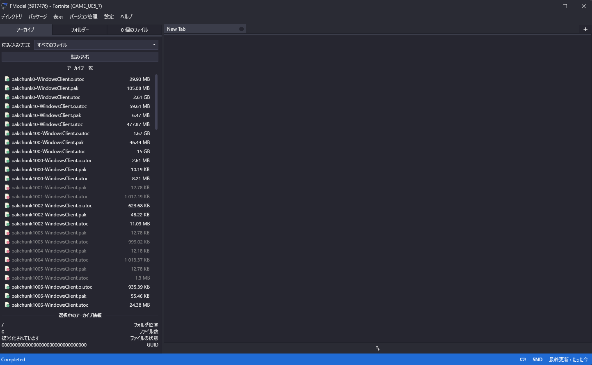
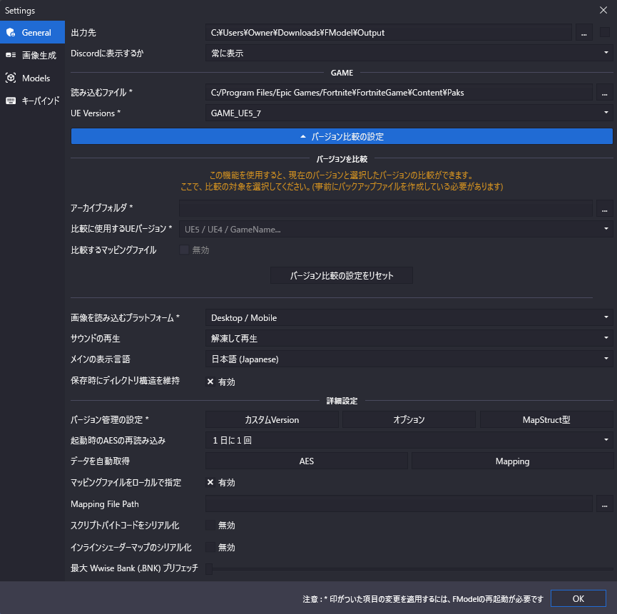

# FModel - 日本語版

**FModel 日本語版** は、Unreal Engine 4 / 5 で作成されたゲームを解析・抽出できるツールである [FModel](https://github.com/4sval/FModel) を日本語化したバージョンです。

英語が苦手な方向けに、**UIを一部日本語化**したFModelです。

・日本語化対象：メニュー・設定・右クリックメニュー・タブ名など

・FModel本体は最新バージョンをベースに改変しています

・このリポジトリは非公式翻訳版です

---

## 日本語版スクリーンショット

| メイン画面 | 設定画面 |
|------------------|----------|
|  |  |

---

## ダウンロードと使用方法

1. [Releases](https://github.com/Fortniteleakjp/FModel-JP-/releases/tag/jp-v1.0.1) からFModel.exeをダウンロード
2. ダウンロードした`FModel.exe` を実行
3. 初回起動時に「ゲームを追加」から対象タイトルを設定
4. 必要に応じて AESキーを設定（暗号化されている場合）

### 注意点
このリポジトリはFModelを基に日本語化したものであり、FModelの公式リポジトリではありません。
また、日本語化に伴う不具合や動作保証は行っておりませんので、自己責任でご利用ください。
元のFModelにはない機能などが追加されています。

---

## 日本語化の範囲

- ✅ メインウィンドウUI
- ✅ メニュー項目（ファイル・表示・ツールなど）
- ✅ 設定画面
- ✅ アセット情報ウィンドウ
- ✅ エラーメッセージ・通知メッセージ

---
